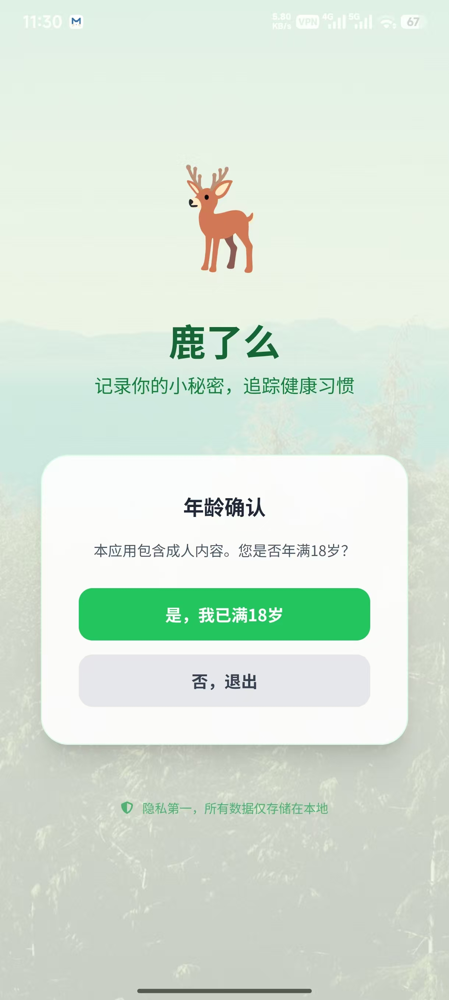
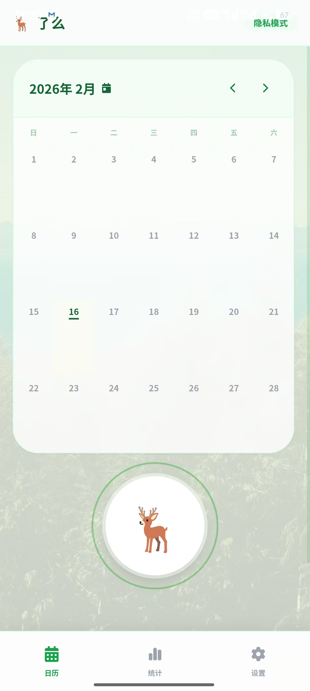
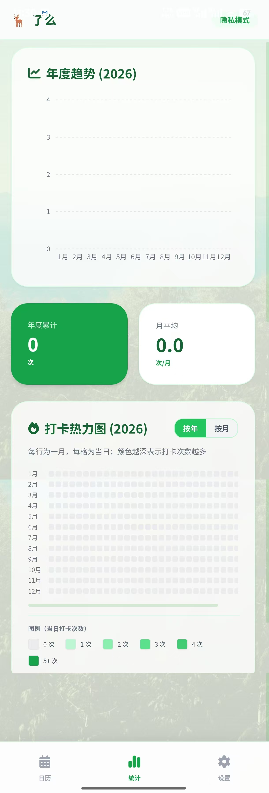
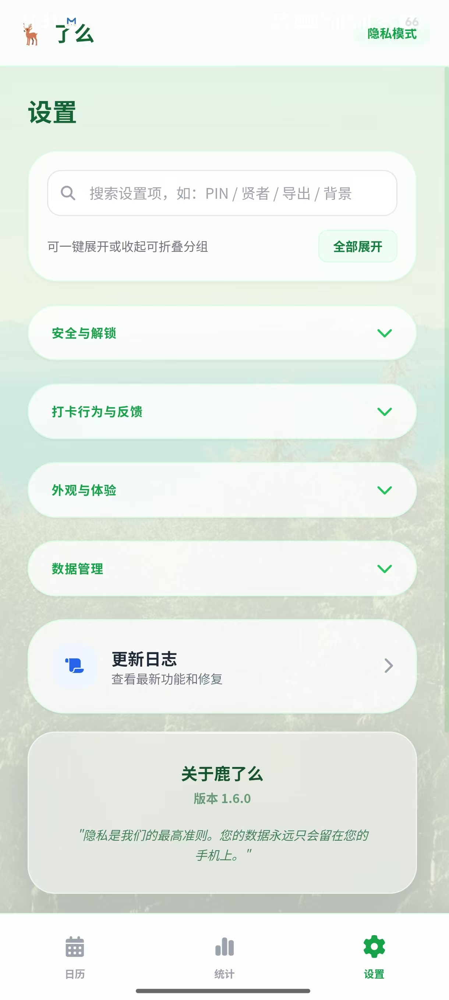

<div align="center">
  
  <h1>鹿了么 (Luleme)</h1>
  <p>记录你的小秘密，追踪健康习惯</p>

  <p>
    
    
    
  </p>
</div>

一个以隐私优先为核心的本地打卡应用，支持日历视图、年度统计、热力图、PIN 锁与生物识别解锁、CSV 导入导出等能力。

## 目录

- [功能亮点](#features)
- [实机截图](#screenshots)
- [技术栈](#tech-stack)
- [快速开始](#quickstart)
- [Android 构建与运行](#android)
- [隐私与数据说明](#privacy)
- [项目结构](#structure)
- [更新记录](#changelog)
- [贡献指南](#contributing)

<a id="features"></a>
## 功能亮点

- 年龄确认与启动引导，首次进入流程更清晰。
- 日历打卡主页，支持按日查看与快速补录。
- 统计页支持年度趋势图与按年/按月热力图切换。
- 设置中心支持搜索、分组折叠、更新日志查看。
- PIN 锁定 + 安全问题 + 生物识别解锁（设备支持时）。
- 贤者模式（冷却模式）可配置时长，避免短时间重复打卡。
- 数据管理支持 CSV 导出、导入与分享。
- 外观与体验可配置：深色模式、自定义图标、背景、音效。

<a id="screenshots"></a>
## 实机截图

> 以下展示对应你提供的 4 张实机演示图。
> 建议将图片放到 `docs/screenshots/` 目录并使用下列文件名，以确保 README 在 GitHub 正常渲染。

<table>
  <tr>
    <td align="center">
      
      <br />
      <sub>年龄确认页</sub>
    </td>
    <td align="center">
      
      <br />
      <sub>日历打卡主页</sub>
    </td>
  </tr>
  <tr>
    <td align="center">
      
      <br />
      <sub>统计与热力图</sub>
    </td>
    <td align="center">
      
      <br />
      <sub>设置中心</sub>
    </td>
  </tr>
</table>

<a id="tech-stack"></a>
## 技术栈

- 前端：React 19 + TypeScript
- 构建：Vite 6
- 移动端封装：Capacitor 6 (Android)
- 图表：Recharts
- 原生能力：Filesystem / Share / Native Biometric

<a id="quickstart"></a>
## 快速开始

### 环境要求

- Node.js 18+
- npm 9+

### 本地开发

```bash
npm install
npm run dev
```

### 生产构建

```bash
npm run build
npm run preview
```

<a id="android"></a>
## Android 构建与运行

```bash
npm run build
npx cap sync android
npx cap open android
```

随后在 Android Studio 中运行或打包 APK/AAB。

<a id="privacy"></a>
## 隐私与数据说明

- 应用数据默认保存在本地（`localStorage`）。
- PIN 与安全问题答案已使用哈希方案存储（PBKDF2-SHA256）。
- 导出功能使用本地文件系统能力，不依赖云端后端。

<a id="structure"></a>
## 项目结构

```text
.
├─ components/         # 页面与核心 UI 组件
├─ utils/              # 工具模块（如 biometric、secret）
├─ android/            # Capacitor Android 工程
├─ App.tsx             # 应用主入口与状态编排
├─ constants.ts        # 常量与本地存储 key
├─ types.ts            # 类型定义
└─ vite.config.ts      # Vite 配置
```

<a id="changelog"></a>
## 更新记录

- 当前版本：`1.6.0`
- 详细变更：应用内「更新日志」弹窗（`components/ChangeLog.tsx`）

<a id="contributing"></a>
## 贡献指南

1. Fork 本仓库并新建分支。
2. 提交改动并补充必要说明。
3. 发起 Pull Request。

---

如果你准备开源发布，建议补充 `LICENSE` 文件并在本 README 增加 License 章节。


## 联网版（Cloudflare）

本项目可基于 Cloudflare 免费额度实现“低成本联网 + 管理后台 + AI 助手 + 应用内更新提示”。

### 一、准备 Cloudflare 资源（免费）

1. 创建 D1 数据库：`luleme-network`。
2. 把 `wrangler.toml` 里的 `database_id` 替换成你的 D1 ID。
3. 安装依赖：

```bash
npm install
```

### 二、数据库迁移（必须按顺序）

```bash
npm run worker:d1:migrate
```

> 迁移文件依次包含：
> - `0001_init.sql`：用户/会话/记录主表
> - `0002_gamification_admin.sql`：角色、地区
> - `0003_user_status_permissions.sql`：账号状态、权限
> - `0004_email_verification.sql`：邮箱验证码
> - `0005_email_verification_purpose.sql`：验证码用途（注册/重置密码）

### 三、免费邮箱验证码注册配置（Resend 免费方案）

Resend 提供免费额度，可用于验证码邮件发送：

```bash
wrangler secret put RESEND_API_KEY
wrangler secret put RESEND_FROM
```

开发阶段可不开通邮件，使用本地调试模式（会返回开发验证码）：

```toml
DEV_BYPASS_EMAIL = "true"
```

### 四、通义千问配置（服务端代理）

```bash
wrangler secret put DASHSCOPE_API_KEY
```

可选模型：

```toml
QWEN_MODEL = "qwen-plus"
ACCESS_TOKEN_SECRET = "a-very-long-random-secret"
```

### 五、应用内更新配置

通过 Worker 变量下发最新版本（App 内可“检查更新”）：

```toml
APP_LATEST_VERSION = "1.6.0"
APP_DOWNLOAD_URL = "https://your-download-link"
APP_RELEASE_NOTES = "修复与优化"
```

### 六、启动与部署

本地启动 Worker：

```bash
npm run worker:dev
```

前端 `.env`：

```bash
VITE_API_BASE_URL=http://127.0.0.1:8787
```

本地启动前端：

```bash
npm run dev
```

部署 Worker：

```bash
npm run worker:deploy
```

### 七、已实现功能总览

- 邮箱验证码注册（免费方案可用）+ 登录/登出/会话续期
- 忘记密码：邮箱验证码重置密码（重置后旧会话自动失效）
- 注册成功并登录进入 App 后再提醒设置地区（自动定位 + 手动填写）
- 打卡数据云同步（D1）
- 总榜/地区榜 + 公共统计（活跃用户、总打卡、今日打卡）
- 成就与修仙等级系统
- 管理员后台：角色切换、账号启停、权限模板、用户关键信息
- 通义千问 AI 问答（服务端代理，避免前端泄露 key）
- App 内检查更新并跳转下载链接


### 八、一次性优化清单（已落地）

- 鉴权安全优化：Access Token 从可读明文改为带 HMAC-SHA256 签名的令牌，服务端对签名与过期时间双重校验。
- 网络可靠性优化：前端请求增加 12 秒超时、GET 自动有限重试（指数退避）、并发 401 刷新收敛（单飞 refresh）。
- 品牌命名修正：全仓 `lulemo` 更名为 `luleme`（包名、存储 key、Worker 服务名、Android 包名、文档）。
